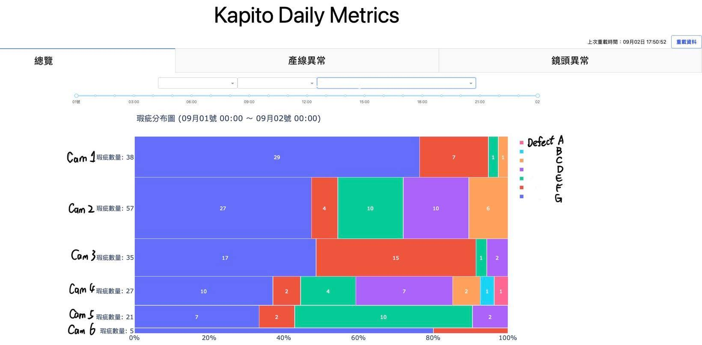
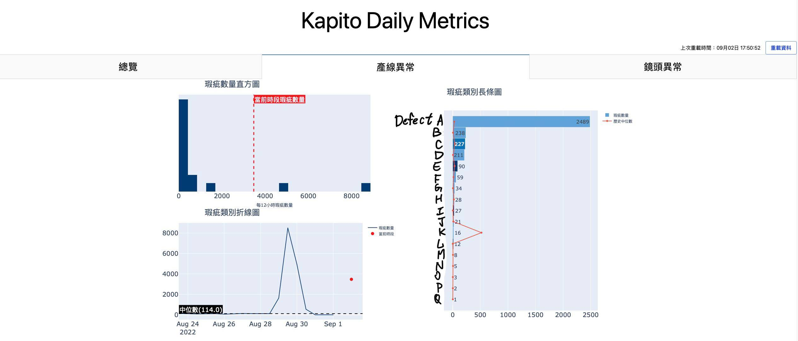
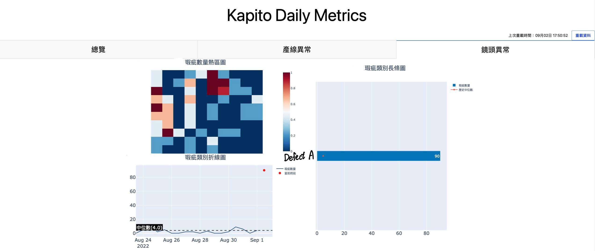
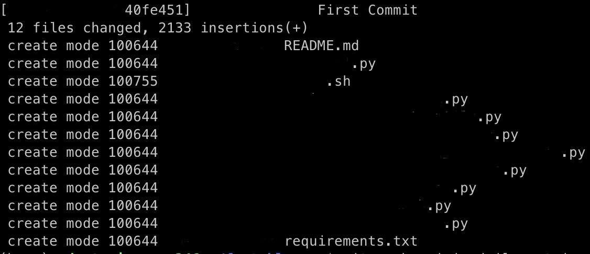
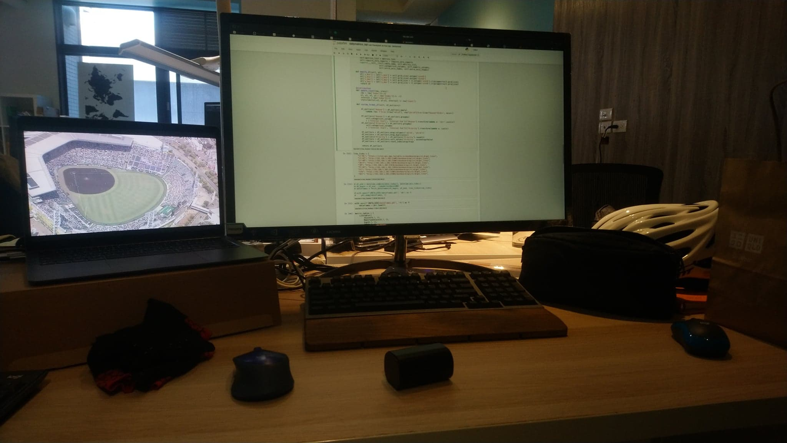
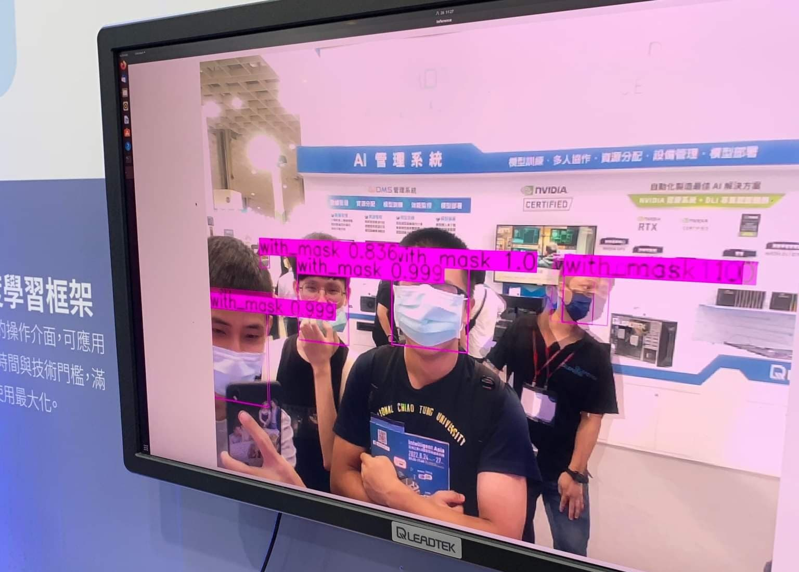

&emsp;&emsp;這篇有點久了，但下工至今趕了一波實驗室paper後，總算是可以在開學地獄前靜下來寫點東西。這是我第一次實習，無論是有些學到看到的東西想做個紀錄，還是之後有人來問的時候可以直接丟link<strike>，抑或是我欠mentor一篇心得</strike>，把一些東西打下來感覺不是壞事。

## Company Info & Interview



 

&emsp;&emsp;[開必拓數據](fastable.ai)，一間用電腦視覺提供智能品控方案的新創公司。當時跟專題隊友在就博會後整理了幾家公司的DM一起投履歷。會投這家絕對不是因為太晚開始寫CV一堆公司都收滿了有個原因是大多數的Intern都是分Frontend跟Backend招，但我比較喜歡碰Data或ML類型的。既然是這種類型的公司，Intern也沒明定收上述兩者，後來就決定投看看。

&emsp;&emsp;如同我面試的另一家新創公司，面試的Lucas (技術長)跟Tina (營運長，我後來的mentor)都是公司的創辦人，但沒有我預期的緊張感，在個人Project的細節討論間穿插一些閒聊。我跟專題隊友的project重疊率太高還在兩分鐘內一起送履歷，所以被看出來應該互相認識，後兩個面試的超怕講錯話還互相複習之前的project怎麼分工的:sweat:。三個人面完都覺得有希望，但全部拿到offer絕對是意料之外。我面的另一家新創公司也有收到offer，但既然開必拓是抱團實習而且面試氛圍不錯，why not give it a go?



## Original Expectations



 

&emsp;&emsp;做為一個把Github當Google Drive，`fork`跟`merge`基本上沒用過的人，去實習的一個期望應該就是看一個公司怎麼維護大型軟體架構；發PR應該是基本，我兩個隊友後來還玩到CI/CD。聽了Tina的Day1簡報後感覺的確是這樣，把既有的Script自動化看起來會吃掉整個七月。一開始進度還算上軌道，前兩週發了2個PR，後來也有一次review的機會 (Thanks Henry :slightly_smiling_face:)，不過我整個暑假的既有軟體維護就到這了......？



## New Project



 

&emsp;&emsp;公司用AI做瑕疵檢測時，無法避免的是這個過程出現瑕疵。鏡頭上黏了一個髒汙，可能就會因為畫面上有個黑點所以狂判瑕疵；如果光影因素讓背景出現類似瑕疵的特徵，也不是不可能誤判。公司的資料專員當然會定期巡查產線狀況，但當客戶生產線越開越多，巡線的週期也會拉長，客戶也就越有可能比公司早發現問題。

&emsp;&emsp;這些事情通常發生在瑕疵數量激增或大減，或是瑕疵大量集中在同一個點的時候。第一週的星期三，Tina就安排了一日黑客松，希望我嘗試這樣的Anomaly Detection，找出潛在的異常產線並回報優先序給資料專員優先巡線。



## Challenges



 

&emsp;&emsp;當天早上創建`Hackathon`這個資料夾時，我並不知道到了八月中這還會是自己主要的工作目錄，也沒想像過這個project能吃掉我整個暑假。Let's see what happened...

### Mathematics

&emsp;&emsp;尋找異常值跟離群值的方法很多，但如果跟實際的資料分布落差過大，那也不合用。我有一天上班在翻大二機率課本跟講義，然後又花了一天畫CDF跟histogram觀察資料，才確定幾個可能可以用的方法。學校數學是用得上的，真心不騙。

### User Feedback

&emsp;&emsp;這個project最後的產物是資料專員巡線時的輔助工具，所以也開了幾次會討論這個project的走向。因為資料專員相對沒有coding背景，對我來說剛好是個練習把我的想法轉成「人話」，同時也嘗試釐清他們需要什麼的機會。考慮到我把code logic跟mentor講的時候就已經說明得有點吃力，這個訓練算是必要的。剛開始的幾次開會看著Zoom上所有人困惑的表情老實說有點絕望，但看在這狀況有在減少，<strike>不論是我真的開始講人話還是與會的各位開始聽懂我的鬼話</strike>，溝通的效率想必多少有所提升🤔

### Infrastructure

&emsp;&emsp;雖然維護既有架構大概在第二週後就已經跳出我的實習計畫之外，但我想以一個Intern來說更難得的經驗是寫新的project時如何顧慮後續開發；就算你是從獨立開發開始，也要讓後續的開發者能看懂你在寫什麼，或是透過相對方便的手段擴充功能。這可能是我第一個有好好用物件導向的project，註解打好打滿，也幾乎follow PEP8的規則。因為暑假期間這個project只有我寫，我其實也不知道這些架構做得如何，但看在mentor過了兩週還沒發LINE噴我，或許還行(？)

### Visualization

&emsp;&emsp;哪些產線有異常應該怎麼呈現也是個探討許久的課題。最簡單的做法就是把篩出來的異常產線直接用`pandas`輸出成csv檔，但顯然易讀性極差。進一步的做法是用Python輸出一個簡單的HTML，把csv的表格輸出，同時附上一些統計圖表的連結，但因為資訊太亂，自己都覺得不堪用了就得另尋做法。最後發現`plotly`可以結合表格、互動式圖表跟HTML，也就用了這個框架完成前端的資料視覺化。要放哪些圖表，則是查了[The Data Visualization Catalogue](https://datavizcatalogue.com/)找靈感，再跟資料專員討論決定。



## Results



 

整個界面有幾張圖表，就順帶說明他們的作用。

&emsp;&emsp;Marimekko Chart (第一張的馬賽克圖)用各個鏡頭和瑕疵在鏡頭內的占比當兩軸，圖塊面積直接對應瑕疵數量，可一覽整個產線眾數。

&emsp;&emsp;長條圖可觀察每種瑕疵的數量，圖上的歷史中位數折線也可作為參考。直方圖跟折線圖都是拿當下資料對應長期分佈，前者方便看出離群值偏離量，後者可以根據時間軸觀測趨勢。

&emsp;&emsp;熱區圖對應鏡頭的實際空間分布，可辨識瑕疵是否集中在同一位置。



## Takeaways



 

### MLOps ([Video Link](https://www.youtube.com/watch?v=06-AZXmwHjo))

&emsp;&emsp;實習的第一天Tina就丟了上面這支影片給我看，基本上也是開必拓做AI時的思維。一個Data Science的研究應該是80% data、20% model，但我們在學校寫作業的時候很少觀察資料特性，反而大多數時間都在調模型參數。如何精緻化餵給模型的資料，還有部屬模型後如何把誤判狀況比較多的case進行修正，可能是個比收集更多資料或加大模型還要有用的做法。雖然我這兩個月實際上根本沒有碰到ML的東西，但這個觀念帶入之後專題研究中NLP的部分，我想是必要的。

### Optimize for Performance

  作為心態上偏向最小努力原則的競程選手，通常時間複雜度正確就不管了，對刷秒數跟記憶體相對不感興趣。不過這次實習處理到$10^8$量級的資料後，有注意到改用幾個函式，或換個寫法，可以讓你使用的RAM砍半，或是讓執行時間從3小時降到20分鐘。學校的作業或比賽碰不到這個數字幾乎不會注意到常數，但現實狀況下這個常數壓掉一半就能省下時間跟運算資源。不過有時間的話，下一步可能需要學的是為什麼這樣優化有用，而不是無知地套用同一個方法。

### 開會大綱很重要

&emsp;&emsp;我常常開會的時候準備要討論的事情很多，但當大家重心放在其中一兩點時，最後幾點很可能就沒辦法深入討論甚至討論不到。後來發現把要討論的東西先丟上slack，想導論的東西就都能討論完。Zoom的40分鐘會議限制也蠻棒的，講重點不浪費時間是個重要原則。

### 遇到問題，提出目前進度跟多種解法，順帶發表自己看法

&emsp;&emsp;Intern Midterm Chat的時候，Lucas跟Tina有提出遇到問題或需要選擇的情境時，跟上司或周圍的人如何回報跟決定。自己後來在工作和其他情境都練習過這樣討論事情，的確對整體效率進展不差。雖然好像發表自己看法好像有點帶風向，但決定不出來的時候拋出點意見或許能加速決定。



## Thoughts



 

&emsp;&emsp;這次實習正好是個讓我看看軟體工程師生活是什麼樣子的機會，兩個月下來也有幾個比較大方向的心得。

1. 自己工作時的特性
   個人觀察下來，工作效率算蠻大起大落的。想法完整或有明確解法時，我可以在電腦前打code兩三個小時；反過來的情況就真的很坐不住，沒幾分鐘就會離開位子，在辦公室角落拉筋也是常有的事。蠻謝謝公司這方面沒什麼限制，我有時候想法上卡住的時候，物理上跳脫現在的狀態還蠻有幫助的。

2. 工作作息
   自己有一週運動五次的習慣，但上班朝九晚六，回到宿舍就已經很累了，就算真要運動也會拖拖拉拉，晚睡又會影響隔天的作息。後來發現7.多起來運動再去上班還不錯，有維持一定的體能訓練，後面要上班除了是個時間上的deadline，也會避免自己過度操勞(尤其考慮還要騎腳踏車去公司的話)，自然就相對不容易受傷。下工後這兩週比較晚睡，希望之後可以調整回來。

3. Startup v.s. Big Companies
   我沒能到大公司實習很大的原因是太晚準備CV，所以我就說服自己去新創公司人少，自己發揮的空間相對多，而事實最後也如同我的想像。在merge PR時是真的不敢按下去的，因為你知道一旦merge就會部署並實際運作。當我把project code整理好最後push到雲端時，也在數字上看到成果：2000+行的Python(含註解)，還有200+行的Markdown (documentation)。雖然程式碼行數真的不代表什麼，但我很清楚這個暑假磨練了多少。雖然startup的實習寫在CV上可能是間名不見經傳的公司，但累積的經驗就我個人而言比履歷上那幾行字重要得多。
   
   > I probably shouldn't be using `git` like this, bUt AnYwAy

4. 找到CS中有興趣然後可以發揮的領域
   雖然看到大多數Intern都招Frontend跟Backend，但還蠻慶幸那時候沒有強迫自己選一個，因為自己還是對觀察資料、想點數學，然後利用這些finding做些什麼比較感興趣；所以大方向上來說，還是ML跟Data Science。

5. Data Science + ?
   雖然如此，我不想單純找有商業價值，或是對公司有益的finding。實習的兩個月雖然是待在做智能品控的公司，但我對這個應用相對不感興趣；同時我也覺得單純做Data Science的衝勁可能可以讓我做兩個月，但很可能撐不了十年。現在想到最可行的解法，就是找有興趣的領域結合目前所學的Data Science。很多人對我大四不打算修任何資工系的課的決定感到訝異，但我可能需要透過這年的修課來探索之後想玩的應用。



## Special Thanks



 

&emsp;&emsp;謝謝Henry在我執行VM和Airflow時提供了不少支援和建議。ところで，日本語で使うWindowsは凄い。

&emsp;&emsp;謝謝HP跟Tyler偶爾會找我們閒聊工作以外的事情。老實說每次Tyler六點來辦公室喊下班時，整間辦公室無動於衷的畫面還頗有喜感的:sweat_smile:。

&emsp;&emsp;謝謝Cindy, Perry, Winni兩個月以來開會的耐心討論，現階段的成品合不合用我不能論斷，但討論後得到明確的開發方向是事實。然後，我如果之後有設定檔出問題，一定會仔細檢查年份的😁

&emsp;&emsp; 謝謝一起實習的Ian跟James每天中午提醒我吃飯，然後三點多提醒我下班。Long year ahead, let's go💪💪

&emsp;&emsp;最後謝謝Lucas跟Tina這個暑假給我們到開必拓實習的機會，還有Tina過去兩個月的mentoring和data science相關知識的分享。雖然沒有訂下明確的時間deadline，但透過提出來的想法跟workload讓我知道有哪些東西是有機會做出來的。兼顧optimistic跟realistic的規劃，絕對是這次實習帶得走的心態。



## Teasers



 

### 工作環境

* 配發設備
  筆電是MacBook Air M1，macOS真香
  鍵盤是一般薄膜鍵盤，如果有慣用的建議帶來公司放

* 辦公室環境
  工作區都在木地板上，然後有個脫鞋的草皮區。雖然說工作久了會相對無感，但第一天去有被嚇到，早上來看到寬敞的空間配置跟明亮的氛圍，心情肯定是不會太差。

* 我的位子
  
  

* 零食區
  大概一週補一次，但有事做的時候自己就不會嘴饞。尤其是週末回家發現自己變胖，其他變因(e.g. 三餐、運動)改動不大的情況下，我背後的零食區絕對是罪魁禍首，自己有注意的情況下自然就不怎麼會拿。
  (btw我8H桌子下的抽屜裡好像屯了一包品客跟餅乾，開必拓的人有看到的話幫忙把它嗑了🤣)

* 交通
  辦公室在新竹迪卡農對面的辦公大樓，經2022暑期實習生實測從交大光復校區
  
  * 走路約30分鐘
  
  * 騎機車約10分鐘，可停好市多室外停車場
  
  * 騎腳踏車最多15分鐘，可停迪卡農旁有遮雨的腳踏車架

* 午餐
  同事會訂外送，但我們三個通常都出去吃。常吃的店家(走路10分鐘內)：
  
  * 麥味登
  * 八方雲集
  * 美美自助餐
  * A-bao cafe (早餐)
  * 日出而作 (早午餐店)
  * 阿枝客棧 (飯/麵餐館)
  
  需要注意哪幾天有開，沒算好的話連吃三天麥味登蠻痛苦的。

### 交通： 光復路上時速35公里的16吋小折

  把通勤當練車好像不太好，但我這麼做了。實習最後一天遇到颱風天，後輪的煞車皮也被磨平了，我不怎麼怕還有點想挑戰的心態。現在回想起來感覺不太對，之後可能收斂點比較好。詳見影片。

<video height="500" controls controlsList="nodownload">  
    <source src="static/biketowork.mp4" type="video/mp4">
    Your browser does not support the video tag.  
</video>

有天上班前還爆胎，感謝Tina通融 :sweat:

### 升大三暑假 v.s. 升大四暑假

&emsp;&emsp;升大三暑假忙宿營的時候，跟朋友寫活動用的**網頁，用tailwind css排版**；**code寫累了**會被找去做道具跟**搬東西**，然後**拿黑色大塑膠袋**做活動的黑幕。

&emsp;&emsp;升大四暑假去實習的時候，幫公司寫分析用的**網頁，用tailwind css排版**；**code寫累了**會被找去拆零件跟**搬東西**，然後**拿黑色大塑膠袋**收公司的廢料。

結論：過去一年自己並沒有任何長進，棒。

### 其他小事

* All Hands Meeting
  或許新創公司的規模才有辦法開全體員工的會議，從大家的對答中有些收穫

* 自動化工業展
  因為公司有參展，實習結束前的星期五我們的mentor們讓我們去南港的自動化工業展參觀，也跟其他參展商聊到很多智慧製造的看法
  
  

* 辦公室的電子鼓
  最後一天才知道是Allen帶來的，表演有秀到🥁

#### Setbacks



 

&emsp;&emsp;當然是不會只寫這間公司有多棒，所以提一個我看到的問題，就是工作量稍嫌不均。我一直有進度可以推，但我有個隊友偶爾會在在等事做。我們猜測的兩個原因可能是project經過多層人事討論，或是涉及既有架構的實作可能要比較謹慎，但這兩個可能問題在任何公司可能都會遇到。也有可能單純就是我隊友太強<strike>，那明年的CHI可以躺分了</strike>。

&emsp;&emsp;還有一個就是，辦公室偏安靜，但認真工作的空間就是這樣吧。顯然我太吵了:thinking:




